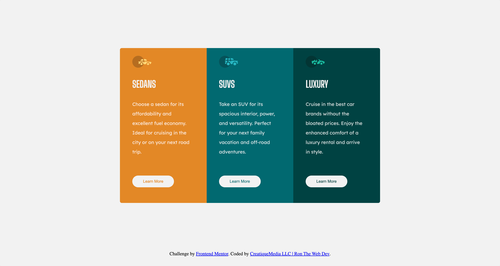
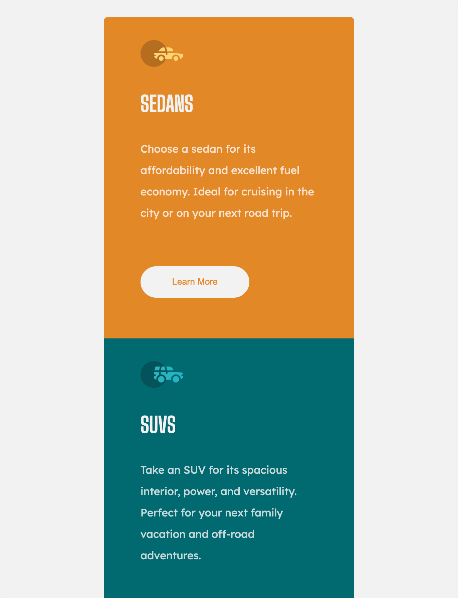

# Frontend Mentor - 3-column preview card component solution

This is a solution to the [3-column preview card component challenge on Frontend Mentor](https://www.frontendmentor.io/challenges/3column-preview-card-component-pH92eAR2-). Frontend Mentor challenges help you improve your coding skills by building realistic projects.

## Table of contents

- [Overview](#overview)
  - [The challenge](#the-challenge)
  - [Screenshot](#screenshot)
- [My process](#my-process)
  - [Built with](#built-with)
- [Author](#links)
- [Links](#links)

**Note: Delete this note and update the table of contents based on what sections you keep.**

## Overview

## The challenge

Your challenge is to build out this 3-column preview card component and get it looking as close to the design as possible.

You can use any tools you like to help you complete the challenge. So if you've got something you'd like to practice, feel free to give it a go.

Your users should be able to:

- View the optimal layout depending on their device's screen size
- See hover states for interactive elements

### Screenshot

Desktop View

Mobile View

## My process

1. I create a project folder structure.
2. I then create a "Project" folder and an "Archive" folder.
3. I download the Frontend Mentor files to the "Archive" folder.
4. I unzip the folder, then I rename the folder to my blog post title and then I copy this folder to the "Project" folder.
5. I then rename the "images" folder to "assets".
6. I then create a "css" folder as a direct child of the project folder.
7. I then create a link to the stylesheet in the <head> of the "index.html" file.
8. I then start coding!

### Built with

- Semantic HTML5 markup
- CSS custom properties
- Flexbox

## Links

Project Links

- CreatiqueMedia Website - https://www.creatiquemedia.com
- CreatiqueMedia | Ron The Web Dev Blog - https://www.blog.creatiquemedia.com
- CreatiqueMedia Frontend Mentor Solution Page: https://www.frontendmentor.io/solutions/responsive-3-column-card-component-HKAWIl1yJc
- CreatiqueMedia Frontend Mentor Profile - [@CreatiqueMedia] - https://www.frontendmentor.io/profile/CreatiqueMedia

Social Links

- CreatiqueMedia Facebook - [@creatiquemediallc] - https://www.facebook.com/creatiquemediallc
- CreatiqueMedia Instagram - [@CreatiqueMedia] - https://www.instagram.com/creatiquemedia
- CreatiqueMedia Twitter - [@CreatiqueMedia1] - https://www.twitter.com/creatiquemedia1
- Ron The Web Dev Facebook - [@ronthewebdev] - https://www.facebook.com/creatiquemediallc
